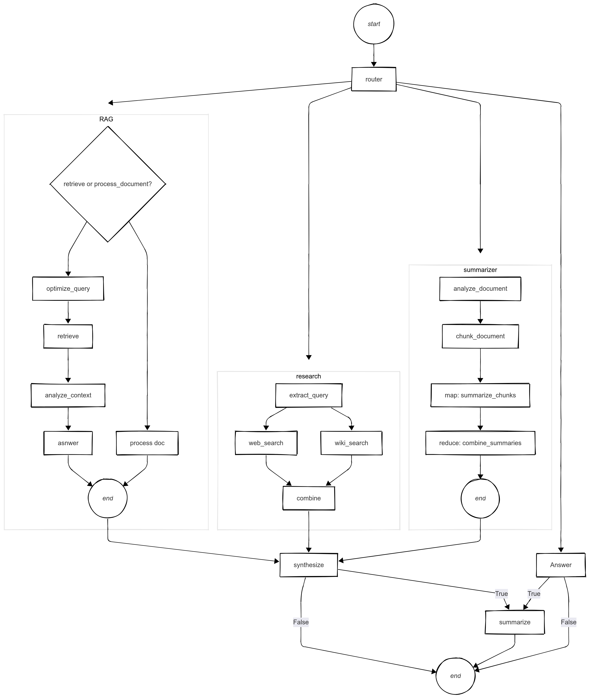

# Multi-Agent System

A Multi-agent system implementing RAG (Retrieval-Augmented Generation) and Research capabilities using LangGraph.

## Features (WIP)

- 🤖 Multiple specialized agents working together
- 📚 RAG Agent for document retrieval and context-aware responses
- 🔍 Research Agent for gathering and synthesizing information
- 🧠 Conversation management with context retention
- 🌐 Graph-based agent orchestration using LangGraph
- 💾 Vector store integration for efficient document retrieval
- 🔄 Automatic conversation summarization
- 🎯 Smart query routing and optimization

## Architecture



The system consists of three main processing paths orchestrated by a central router:

1. **Router**: Intelligent component that analyzes incoming queries and directs them to the most appropriate path:
   - Complex document-based queries → RAG
   - Research-requiring queries → Research
   - Simple/direct queries → Quick Answer

2. **RAG (Retrieval-Augmented Generation)**:
   - Handles document-based queries through two main paths:
     - Document Processing: Direct processing of input documents
     - Retrieval Path: Query optimization → Retrieval → Context Analysis → Answer Generation
   - Provides context-aware responses using the document knowledge base

3. **Research**:
   - Parallel search architecture combining web and wiki sources
   - Query extraction and optimization
   - Result synthesis and combination
   - Comprehensive information gathering and analysis

4. **Quick Answer**:
   - Direct path for simple queries that don't require document retrieval or research
   - Efficient handling of straightforward questions
   - Leverages model's base knowledge

The system features intelligent flow control:
- All paths converge at a synthesis step for unified response generation
- Automatic summarization triggers when conversation length exceeds 5 messages
- Smart end-state handling based on:
  - Query complexity
  - Conversation length
  - Processing requirements

## Quick Start

1. Clone the repository:
   ```bash
   git clone https://github.com/yourusername/multi_agent_system.git
   cd multi_agent_system
   ```

2. Install uv (recommended for faster, more reliable dependency management):
   ```bash
   # On Unix-like systems
   curl -LsSf https://astral.sh/uv/install.sh | sh

   # On Windows PowerShell
   powershell -c "irm https://astral.sh/uv/install.ps1 | iex"
   ```

3. Create virtual environment and install dependencies:
   ```bash
   # Create and activate virtual environment
   uv venv
   source .venv/bin/activate  # On Windows: .venv\Scripts\activate

   # Install dependencies from pyproject.toml
   uv pip install -e ".[dev]"
   ```

4. Set up your environment variables:
   ```bash
   cp .env.example .env
   # Edit .env with your API keys
   ```

## Project Structure

```plaintext
multi_agent_system/
├── src/                                # Source code
│   ├── agents/                         # Agent implementations
│   │   ├── orchestrator/               # Main orchestration logic
│   │   ├── rag/                        # RAG agent for document Q&A
│   │   └── researcher/                 # Research agent for web search
│   ├── utils/                          # Shared utilities
│   └── config.py                       # System configuration
│
├── .env.example                        # Environment template
├── .gitignore                          # Git ignore rules
├── .pre-commit-config.yaml             # Pre-commit hooks configuration
├── langgraph.json                      # LangGraph configuration
├── pyproject.toml                      # Project and dependency configuration
├── README.md                           # Project documentation
└── uv.lock                             # UV dependency lock file
```

### Key Components

- **Orchestrator Agent**: Routes queries and manages agent interactions
- **RAG Agent**: Handles document retrieval and question answering
- **Research Agent**: Performs web research and information synthesis
- **Utils**: Shared tools for file operations and message handling

## Development Setup

### Dependencies

All project dependencies are managed in `pyproject.toml`:

- **Core Dependencies**: LangChain, LangGraph, and related packages
- **Development Dependencies**: Testing, linting, and formatting tools

To update dependencies:
```bash
# Update all dependencies to their latest compatible versions
uv pip compile pyproject.toml -o uv.lock

# Install updated dependencies
uv pip install -e ".[dev]"
```

### Pre-commit Hooks

We use pre-commit hooks to ensure code quality. To set up:
```bash
pre-commit install
```

To run the hooks manually:
```bash
pre-commit run --all-files
```

## Environment Variables

Required API keys and configurations (see `.env.example`):
- `OPENAI_API_KEY`: For LLM and embeddings
- `TAVILY_API_KEY`: For web search
- `LANGCHAIN_API_KEY`: For LangSmith tracing (optional)

## Status

🚧 **Work in Progress** 🚧

This project is under active development. Features and documentation will be updated regularly.

## License

This project is licensed under the MIT License - see the [LICENSE](https://github.com/cgoncalves94/multi_agent_system/blob/main/LICENSE) file for details.
